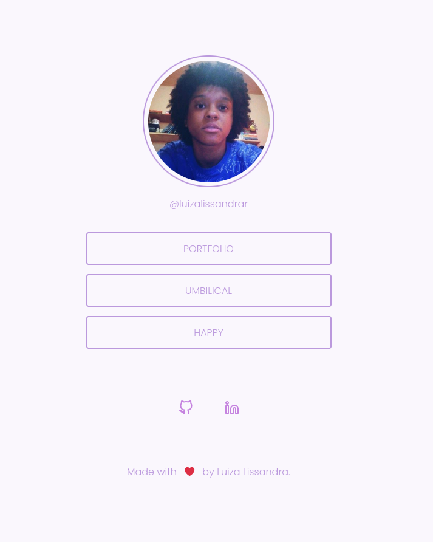

# Social tree

In this project I was challenged to make a Social Tree using HTML and CSS. I added responsiveness. 

See the <a href="https://lissandrarodrigues.github.io/social-tree/"> deployment</a>.



<a href="https://app.rocketseat.com.br/discover/challenges/social-tree"> More about this challenge. </a>

## Technologies used

- HTML
- CSS

## Install this project 

```bash
# Clone this project:
$ git clone https://github.com/LissandraRodrigues/social-tree

# Acess:
$ cd social-tree 
```
